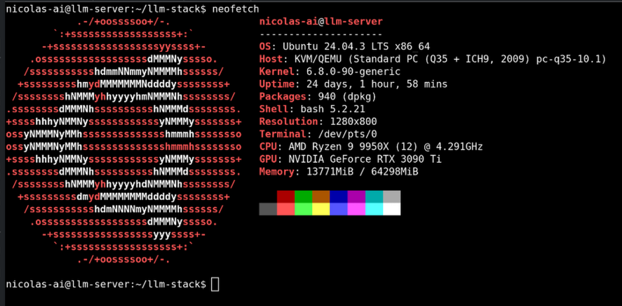
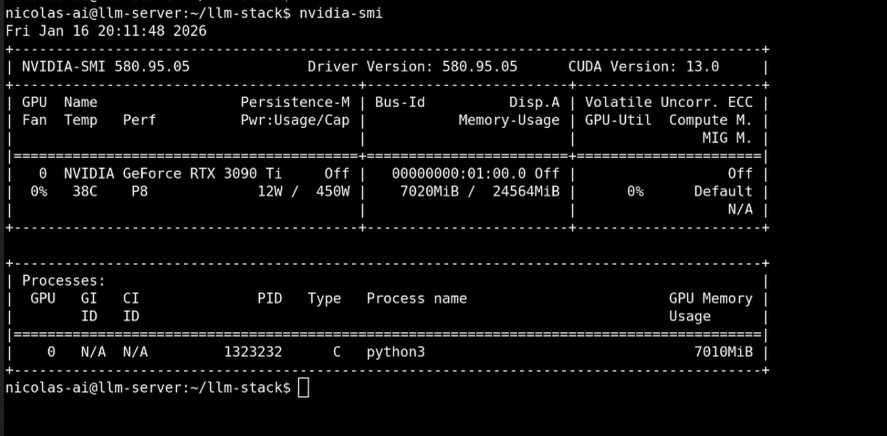
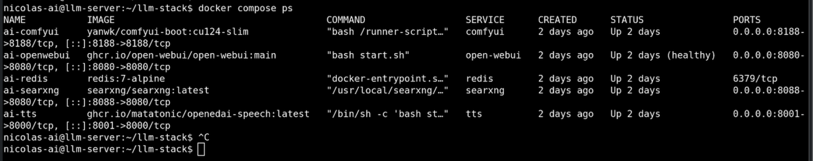
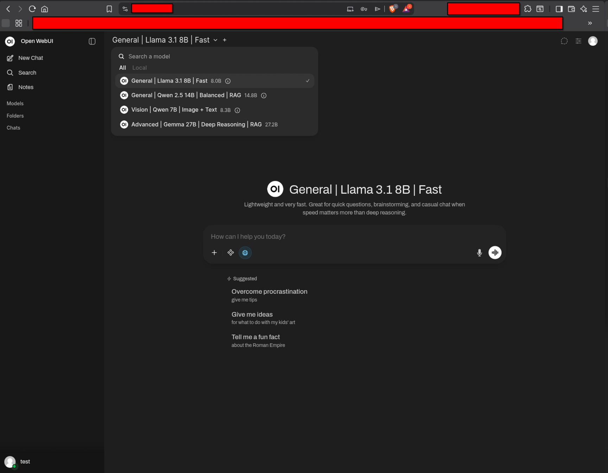
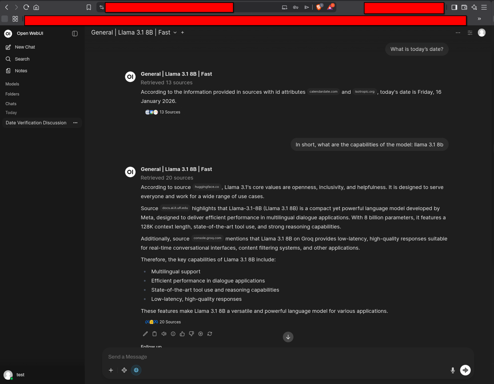
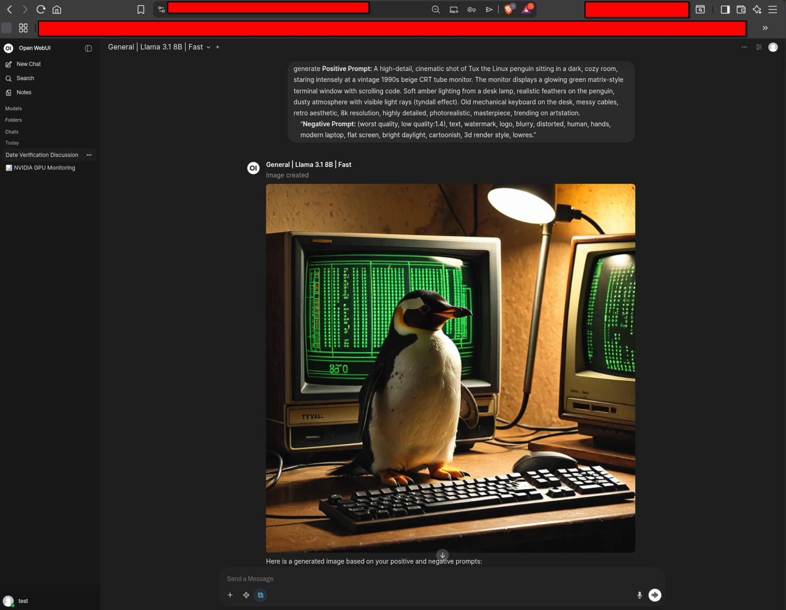
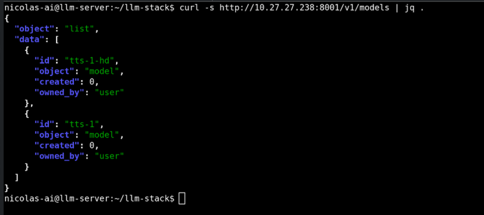
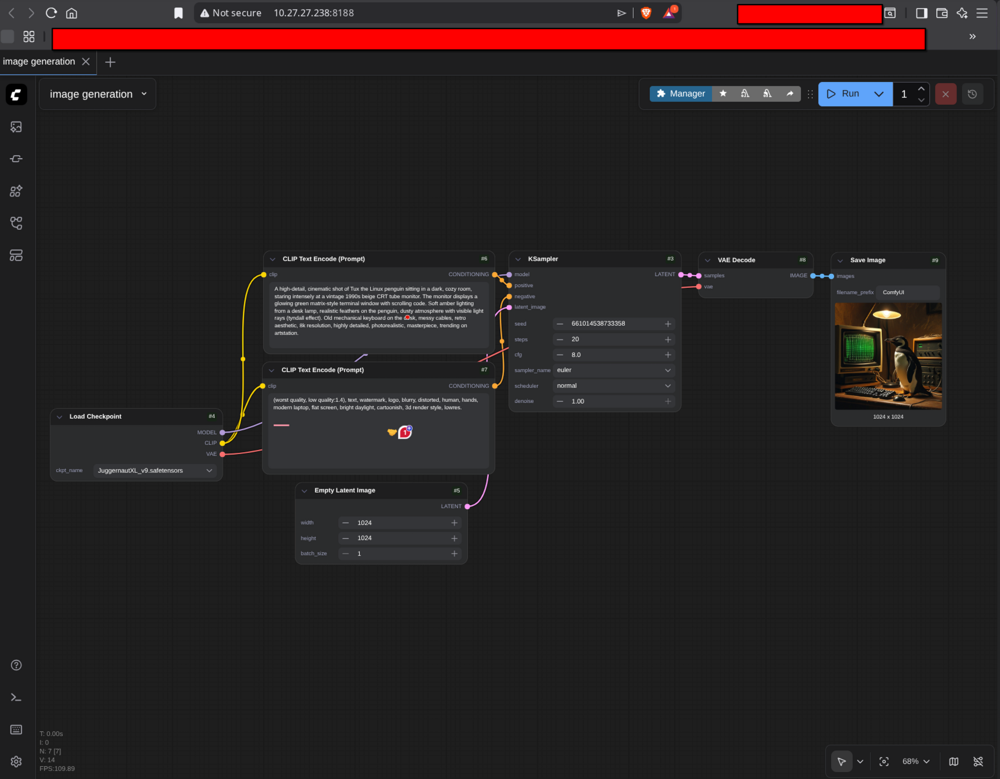

# Private AI Stack

A self-hosted private AI system (ChatGPT-style) running on Proxmox with Docker, GPU acceleration, and secure external access via Cloudflare Tunnel. Supports chat, vision, image generation, web search, and TTS/STT.

## ⚡ Quick Navigation
- **[Architecture](./docs/architecture.md)** — Hardware, network flow, threat boundaries
- **[Installation](./docs/installation.md)** — Host/VM prerequisites and setup
- **[Configuration](./docs/configuration.md)** — Service wiring, storage (NFS/ZFS), tuning
- **[Usage Guide](./docs/usage.md)** — Operator’s manual (daily workflows)

## Repository Layout
- `docker-compose.yml` – Full stack definition
- `docs/`
  - `architecture.md` – Diagrams and system design
  - `installation.md` – Setup procedure
  - `configuration.md` – Env vars, persistence, NFS/ZFS, GPU notes
  - `usage.md` – How to use Open WebUI + ComfyUI
- `searxng/` – SearXNG config (`settings.yml`, etc.)
- `tts/` – OpenedAI-Speech voice models + mappings

## ✨ Features
- Multiple chat models (Llama 3.1, Qwen 7B, Gemma 27B)
- Image generation via ComfyUI backend
- Vision support (use the Qwen Vision model when analyzing images)
- Web search via SearXNG (toggle per message)
- Text-to-Speech via OpenedAI-Speech (OpenAI-compatible API)
- Speech-to-Text via Whisper/faster-whisper
- Persistent storage on NAS via NFS (`/mnt/ai`)
- Secure external access via Cloudflare Tunnel + MFA

## 🧱 Architecture (high-level)

```text
User → Cloudflare Tunnel (+MFA) → Open WebUI
                               ├─ Ollama (LLMs, on VM host)
                               ├─ SearXNG (web search)
                               ├─ OpenedAI-Speech (TTS)
                               ├─ Whisper (STT)
                               └─ ComfyUI (image generation, GPU)
Storage: VM mounts NAS dataset via NFS at /mnt/ai (persistent volumes)
```
Full details: [docs/architecture.md](https://github.com/nicolasnkGH/ai-stack/blob/main/docs/architecture.md)

## ⚙️ Performance Notes (rule of thumb)

* Chat is mostly GPU-bound (CPU is usually low)

* Image generation is GPU-bound

* Typical VM sizing: 6–8 vCPU, 32–64GB RAM, GPU passthrough

---

## 📸 Proof of Life

This stack is fully operational and GPU-accelerated.

### System & GPU

**VM Info**
  

**GPU Usage**
  

**Docker Stack**
  

### Open WebUI


**Model Selection**  
  

**Chat + RAG**  
  

**Vision**  
  

**Model Generating Image** 
  

### API & TTS

  

### Image Generation (ComfyUI)

  


---
Maintained by Nicolas Teixeira.

  
