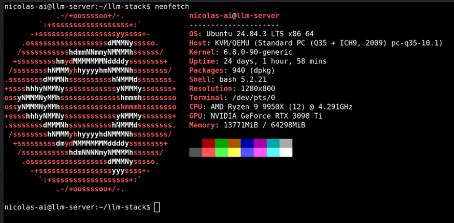
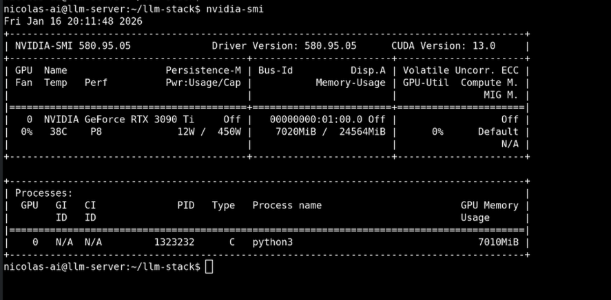
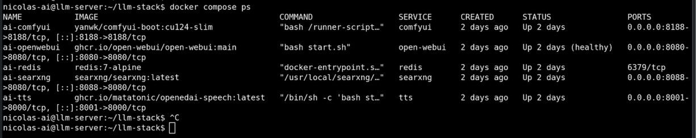
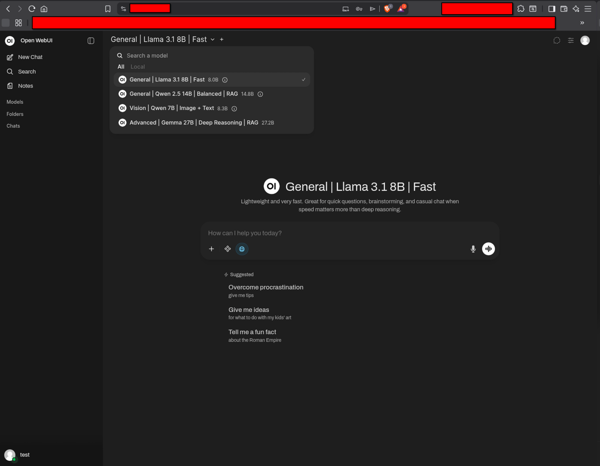
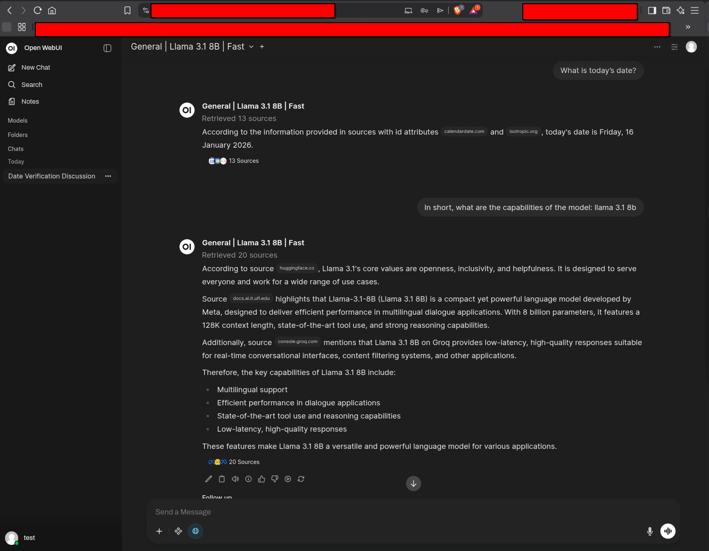
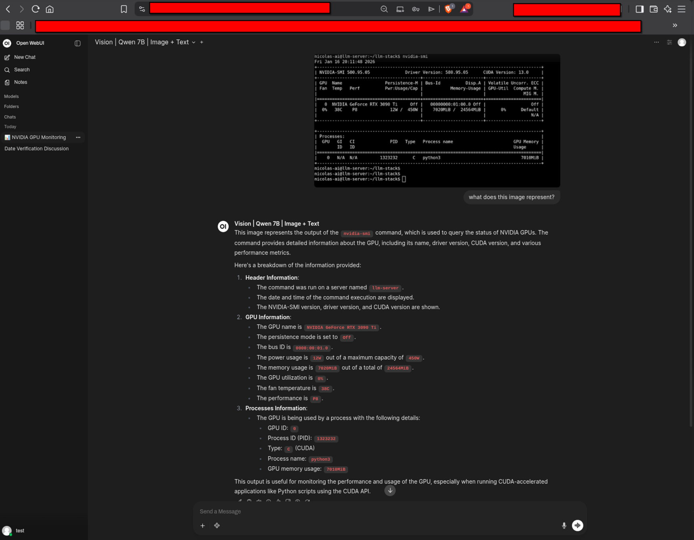
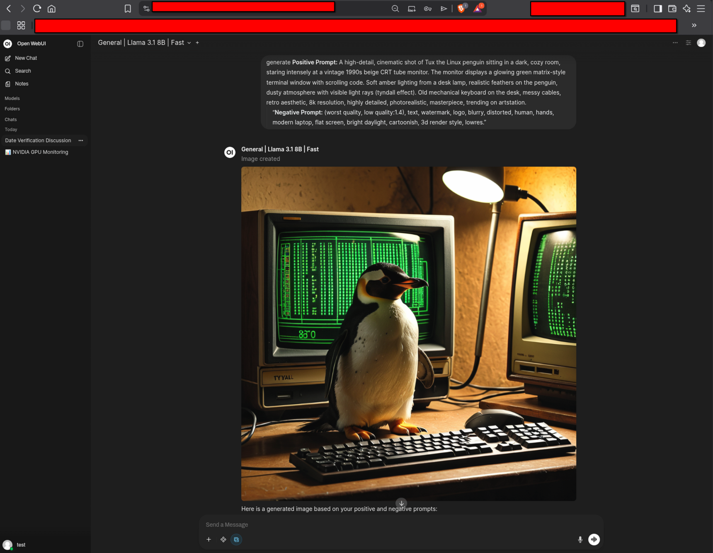
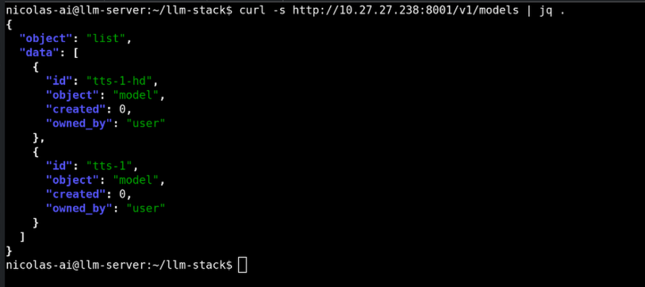
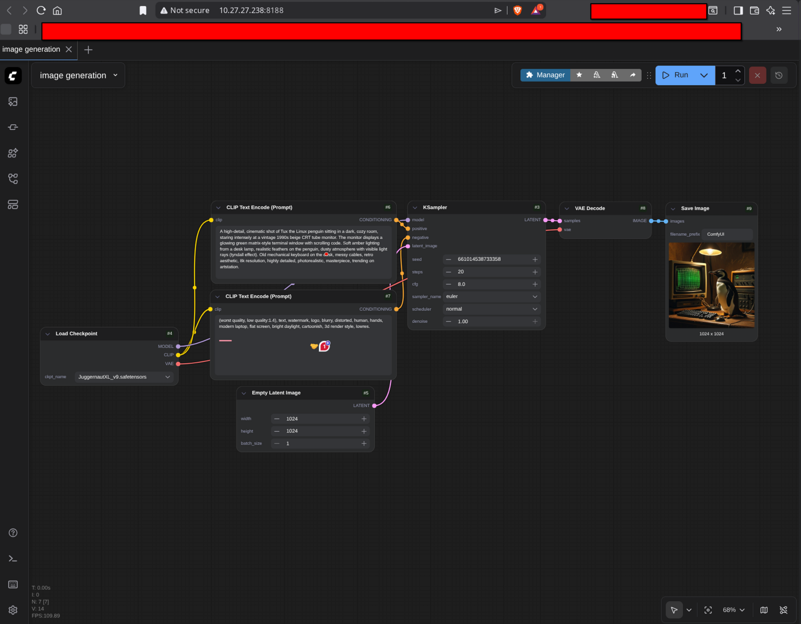

# Private AI Stack

A self-hosted, private AI system (ChatGPT-style) running on Proxmox with Docker, GPU acceleration, and secure external access via Cloudflare Tunnel. Supports chat, vision, image generation, web search, and TTS/STT.

## ⚡ Quick Navigation

-   **[Architecture](./docs/architecture.md)** — Hardware, network flow, security boundaries
-   **[Installation](./docs/installation.md)** — Host/VM prerequisites and setup
-   **[Configuration](./docs/configuration.md)** — Service wiring, storage (NFS/ZFS), tuning
-   **[Usage Guide](./docs/usage.md)** — Operator's manual (daily workflows)

## Repository Layout

```text
.
├── docker-compose.yml     # Main stack orchestration (GPU + Volumes)
├── .env.example           # Template for secrets (Google Drive, URLs)
├── .gitignore             # Prevents secrets and local databases from being committed
├── scripts/
│   └── backup-db.sh       # Nightly database backup to NFS
├── docs/                  # In-depth technical documentation
│   ├── architecture.md    # Network flow & security boundaries
│   ├── installation.md    # Host/VM setup & GPU passthrough
│   ├── configuration.md   # Hybrid storage & VRAM tuning
│   └── usage.md           # Operator's manual for UI workflows
├── searxng/               # Custom meta-search configuration
│   └── settings.yml       # Engine filters & privacy settings
└── tts/                   # Speech synthesis assets
    ├── voices/            # Local voice model files
    └── config/            # Audio mapping & endpoint settings
```

## ✨ System Features & Capabilities

Engineered for maximum throughput and local data sovereignty.

### 🧠 Intelligence & Next-Gen Models

Powered by **Ollama** & **RTX 3090 Ti**.

*   **LLM Support:** Llama 3.1, Qwen 2.5 Coder, Gemma 3 (12B/27B) – handles vision and text.
*   **Web Search:** Privacy-first RAG via self-hosted SearXNG.
*   **Cloud Integration (Optional):** Secure Google Drive access.

### ⚡ Performance & Hybrid Infrastructure

Dual-storage eliminates I/O bottlenecks.

*   **Storage:** Critical data (LLM models, databases, Redis) on local NVMe/SSD (`/opt/ai`); bulk assets on NFS (`/mnt/ai`).
*   **Image Generation:** ComfyUI for node-based workflows.
*   **Audio:** OpenAI-compatible TTS & STT (local).
*   **VRAM Management:** Dynamic `keep_alive` ensures **24GB VRAM** availability for ComfyUI workflows.

### 🛡️ Security & Sovereignty

Enterprise-grade protection for a 100% private AI experience.

*   **Remote Access:** Zero-trust via Cloudflare Tunnel + MFA.
*   **Data Sovereignty:** All processing local in Columbus, Ohio. No data leaves the host.

---

## 🧱 Architecture (high-level)

```text
┌──────────────────────┐     ┌────────────────────────────┐
│ AI Agents / Clients  │────▶│ LiteLLM Proxy (:4000)      │
│ (OpenAI-compatible)  │     │ Unified OpenAI endpoint    │
└──────────────────────┘     └──────────────┬─────────────┘
                                             │
                                             ├──▶ llama-36b ──▶ Primary NVIDIA server (:8081)
                                             │                  host: 10.0.0.10
                                             ├──▶ llama-9b  ──▶ Secondary ROCm server (:8083)
                                             │                  host: 10.0.0.20  (llm-server2)
                                             └──▶ llama-4b  ──▶ Secondary ROCm server (:8082)
                                                               host: 10.0.0.20  (llm-server2)

┌──────────────────────┐
│ Open WebUI (:8080)   │──▶ LiteLLM Proxy (:4000)
└──────────┬───────────┘
           ├──▶ Redis  :6379   (sessions/cache)
           └──▶ SearXNG:8088   (web search)

External access: User → Cloudflare Tunnel (+MFA) → ai-api.example.com → Open WebUI / LiteLLM
Storage: VM mounts NAS dataset via NFS at /mnt/ai (persistent volumes)
```

> **Backends:** The primary server runs the large NVIDIA-accelerated model (`llama-36b`). A secondary ROCm-based server (`llm-server2`) hosts two smaller models (`llama-9b`, `llama-4b`). LiteLLM aliases route each model name to the correct backend.

Full details: [docs/architecture.md](https://github.com/nicolasnkGH/ai-stack/blob/main/docs/architecture.md)

## ⚙️ Performance Notes (rule of thumb)

* Chat is mostly GPU-bound (CPU is usually low)

* Image generation is GPU-bound

* Typical VM sizing: 6–8 vCPU, 32–64GB RAM, GPU passthrough

* **Hybrid Storage**: Performance-critical data (LLM models, Databases, Redis) resides on **local SSD (`/opt/ai`)** to eliminate 1Gbps NFS latency and GPU starvation.
* **Bulk Storage**: Large assets (Image outputs, RAG uploads) remain on **NFS (`/mnt/ai`)** to leverage NAS capacity without impacting UI snappiness.
* **VRAM Management**: Main models use a 5-10 minute `keep_alive` to ensure the **24GB VRAM** is freed for ComfyUI workflows.

---

## 🚀 Quick Start
1. **Prepare Host Directories**:
   ```bash
   sudo mkdir -p /opt/ai/{ollama,comfyui/models,open-webui,redis}
   sudo chown -R 1000:1000 /opt/ai
   ```
2. **Configure Secrets**:
   ```bash
   cp .env.example .env
   # Edit .env — fill in placeholders such as:
   #   LITELLM_MASTER_KEY=<your-secret-key>
   #   CF_ACCESS_CLIENT_ID=<CF_ACCESS_CLIENT_ID>
   #   CF_ACCESS_CLIENT_SECRET=<CF_ACCESS_CLIENT_SECRET>
   #   LITELLM_PRIMARY_URL=http://10.0.0.10:8081
   #   LITELLM_SECONDARY_URL=http://10.0.0.20:8082
   ```
3. **Launch:**
   ```bash
   # Pull pre-built images (Open WebUI, Redis, SearXNG, etc.)
   docker compose pull

   # Build services that have a local Dockerfile (e.g. LiteLLM with custom config)
   docker compose build

   # Start the full stack
   docker compose up -d
   ```

### 🔄 Recommended Update Sequence
```bash
# 1. Pull latest upstream images
docker compose pull

# 2. Rebuild any locally customized services
docker compose build --no-cache litellm

# 3. Restart the stack
docker compose up -d --remove-orphans
```

> **`pull` vs `build`:** Services that ship from a registry (Open WebUI, Redis, SearXNG) are updated with `docker compose pull`. Services with a local `Dockerfile` or custom entrypoint (LiteLLM config, custom proxy layer) require `docker compose build`. Always run both when unsure.

### 🛠️ Troubleshooting Stale Builds
If a service behaves unexpectedly after an update (e.g. old config still active):
```bash
# Force a clean rebuild of a specific service
docker compose build --no-cache <service-name>

# Remove the old container and restart
docker compose rm -sf <service-name>
docker compose up -d <service-name>

# Check logs for the service
docker compose logs -f <service-name>
```


### ☁️ Optional: Google Drive Integration
To enable Google Drive support for document RAG, you must follow the [official Open WebUI Google Drive Guide](https://docs.openwebui.com/reference/env-configuration#google):
1. Create a project in the Google Cloud Console.
2. Enable the Google Drive API.
3. Configure the OAuth consent screen and create credentials.
4. Uncomment the Google Drive section in `docker-compose.yml` and add your keys to `.env`.

---

## 📸 Proof of Life

### 🖥️ System & Hardware
| Host Specifications | GPU Status (`nvidia-smi`) |
| :--- | :--- |
|  |  |

<details>
<summary><b>🔍 View Docker Stack Health</b></summary>


</details>

---

### 💬 Open WebUI Interface
*A unified hub for LLMs, RAG, and multimodal workflows.*

| Model Selection & Fast-Switching | Advanced RAG + Web Search |
| :--- | :--- |
|  |  |

| Vision & Multimodal Analysis | Image Generation (DALL-E 3 Style) |
| :--- | :--- |
|  |  |

---

### 🎨 Backend Services
<details>
<summary><b>🛠️ View API & ComfyUI Workflows</b></summary>

#### OpenAI-Compatible TTS API


#### ComfyUI Node-Based Workflow

</details>

---

## 💾 Maintenance: Automated Backups
Since performance-critical data lives on the local VM disk, a safety-net script is provided to sync the database back to the NFS nightly.

1.  **Make script executable**:
    ```bash
    chmod +x ./scripts/backup-db.sh
    ```
    
3.  **Add to Crontab**:
    ```bash
    # Runs daily at 3:00 AM
    (crontab -l 2>/dev/null; echo "0 3 * * * /home/ubuntu/ai-stack/scripts/backup-db.sh") | crontab -
    ```

---
*Maintained by Nicolas Teixeira.*
  
