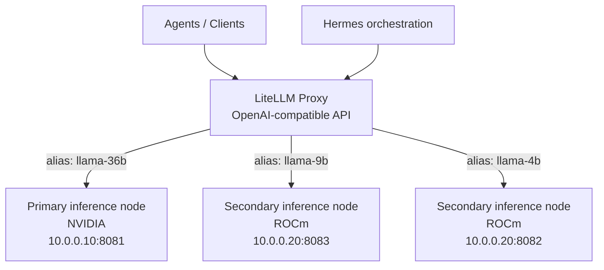

# AI Stack — Inference Infrastructure for Agent Workloads

This repository is a **public, sanitized showcase** of a self-hosted AI platform built for agent and API workflows. It demonstrates how to run a multi-node inference layer behind a single OpenAI-compatible endpoint, operate it with containerized infrastructure, and orchestrate higher-level task execution with human approval gates.

## What this project demonstrates

- **Inference infrastructure engineering**: dual-server topology with model placement by hardware profile.
- **Model routing design**: LiteLLM alias-based routing behind one client-facing API.
- **Container operations**: mixed pull/build deployment strategy for reproducible updates.
- **Reliability mindset**: health checks, validation flow, rollback-first operations.
- **Automation/orchestration**: event-driven Hermes workflow with kanban tracking and Telegram approvals.

## Architecture (high level)


```mermaid
graph TD
    C[Agents / Clients] --> G[LiteLLM Proxy\nOpenAI-compatible API]

    G -->|alias: llama-36b| P[Primary inference node\nNVIDIA\n10.0.0.10:8081]
    G -->|alias: llama-9b| S1[Secondary inference node\nROCm\n10.0.0.20:8083]
    G -->|alias: llama-4b| S2[Secondary inference node\nROCm\n10.0.0.20:8082]

    E[Hermes orchestration] --> G
```

### Component responsibilities

| Component | Responsibility |
| --- | --- |
| LiteLLM proxy | Single OpenAI-compatible ingress, alias routing, centralized API behavior |
| Primary node | Hosts larger model service for higher-quality reasoning workloads |
| Secondary node | Hosts smaller/faster services for routing flexibility and load distribution |
| Hermes | Event intake, task lifecycle orchestration, approvals, and execution coordination |

## Inference routing model (LiteLLM aliases)

| Alias | Backend URL (example) | Typical use |
| --- | --- | --- |
| `llama-36b` | `http://10.0.0.10:8081` | Deep reasoning / complex analysis |
| `llama-9b` | `http://10.0.0.20:8083` | Balanced latency + quality |
| `llama-4b` | `http://10.0.0.20:8082` | Fast automation and utility tasks |

Client-facing endpoint shape (example):

- Public: `https://ai-api.example.com/v1`
- Internal: `http://127.0.0.1:4000/v1`

## Custom build strategy for llama.cpp inference services

This stack is not presented as “just running llama.cpp.” The inference layer is operated as **customized container services** with explicit build/runtime choices, for example:

- Reproducible Docker build contexts for runtime dependencies.
- Targeted compile/runtime flags per hardware class (NVIDIA vs ROCm hosts).
- Separate service images and ports to keep routing, scaling, and updates predictable.
- Gateway-level aliasing so model/backend changes do not break client integrations.

## Hermes orchestration workflow (high level)

Hermes adds operational control above inference:

1. **Event/Webhook intake** from external systems.
2. **Task creation and kanban tracking** in a SQLite-backed workflow board.
3. **Human-in-the-loop approval** via Telegram notifications/commands.
4. **Execution lifecycle management** (queued → approved → running → completed/failed).
5. **Status feedback loop** back to operators.

## Deployment and update runbook (mixed build + pull)

```bash
# 1) Fetch upstream images for pull-based services
docker compose pull

# 2) Rebuild locally customized services
docker compose build

# 3) Start or refresh stack
docker compose up -d --remove-orphans
```

### Build vs pull

- Use `pull` for services sourced directly from registries.
- Use `build` for services with local Dockerfiles or custom image logic.
- In mixed stacks, run both each update cycle.

### Validation and health checks

```bash
docker compose ps
docker compose logs --tail=100
curl -sSf http://127.0.0.1:4000/health || true
```

## Reliability and operations notes

- Prefer small, reversible updates over large changes.
- Validate gateway + backend reachability after each deploy.
- Keep rollback simple: restore last-known-good images/config and restart.
- Treat observability and runbooks as part of system design, not afterthoughts.

## Repository guide

- [docs/architecture.md](docs/architecture.md) — topology and component boundaries
- [docs/configuration.md](docs/configuration.md) — sanitized configuration patterns
- [docs/installation.md](docs/installation.md) — deployment workflow and prerequisites
- [docs/models.md](docs/models.md) — model roles and routing intent
- [docs/usage.md](docs/usage.md) — operator workflows and lifecycle

## Legacy scope note

This repository includes artifacts from earlier UI/image-generation experiments (for example ComfyUI-related paths). They are retained as optional/legacy context and are **not** the primary architecture narrative.

## Security & sanitization note

All infrastructure identifiers in this repository are placeholders:

- Example domains (`*.example.com`)
- RFC1918 IP examples (`10.0.0.0/8`)
- Redacted credentials/tokens (`<REPLACE_ME>`)

Do not publish real hostnames, secrets, private API keys, or environment-specific internal paths.

## License

[MIT](LICENSE)
