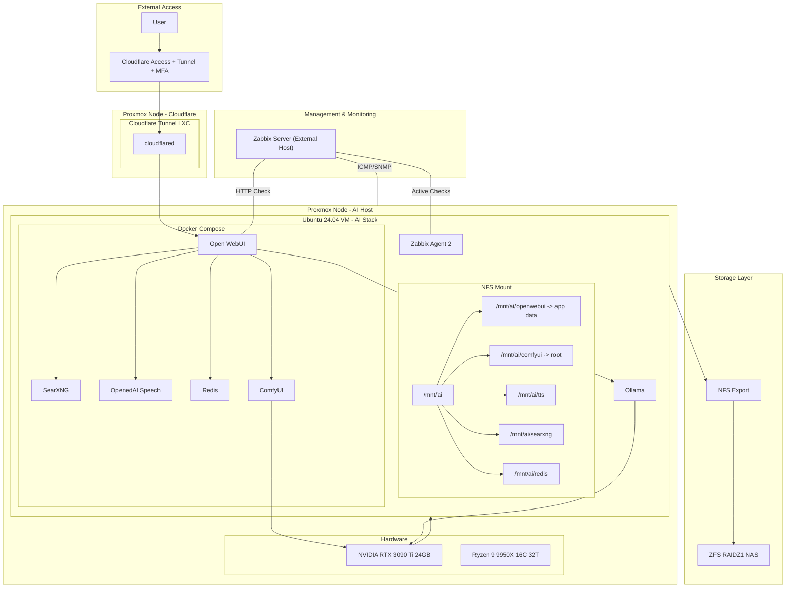

# System Architecture

This document details the hardware and software orchestration of the Private AI Stack, focusing on the hybrid integration between virtualized resources and containerized services.

---

## High-Level Diagram

A visual representation of the system architecture, showing the relationships between components such as Cloudflare, Proxmox, Docker Compose, and ZFS.

---

## 🛠️ Storage Reliability & Maintenance

Details on how data integrity is ensured through regular ZFS scrubbing, atomic snapshots, and snapshot retention to protect against data corruption and faults.

The ZFS pool (`RAIDZ1`) on the NAS serves as the single source of truth for the entire stack's persistent state.

- **Data Integrity (Scrubbing):** A monthly ZFS scrub is scheduled on the NAS to detect and repair silent data corruption (bit-rot).
- **Atomic Snapshots:** Before any major stack upgrade or configuration change, an atomic ZFS snapshot is taken of the `/mnt/ai` dataset. This allows for a near-instantaneous rollback of all model weights, databases, and application configs simultaneously.
- **Snapshot Retention:** Using a simple cron-based script, snapshots are retained on a `7-day / 4-week / 3-month` rotation to balance protection and storage capacity.

---

## ⚡ Hypervisor-Level Tuning

Optimizations made at the hypervisor level (Proxmox) to achieve near-metal performance for the NVIDIA RTX 3090 Ti GPU and Ryzen 9950X CPU, including Hugepages and IOMMU isolation.

To achieve near-metal performance for the RTX 3090 Ti and the Ryzen 9950X, the following Proxmox optimizations are applied:

- **CPU Type (Host):** The VM CPU is set to `host` rather than `kvm64`. This passes through the specific instruction sets (AVX, AVX2, and AVX-512) required for high-performance tensor operations in LLMs and vision models.
- **Hugepages:** 2MB Hugepages are enabled on the Proxmox host to reduce the memory management overhead for the AI VM, significantly improving throughput for large VRAM-intensive models like Gemma 27B.
- **IOMMU Isolation:** The GPU and its associated audio controller are isolated in their own IOMMU group using `pcie_acs_override` where necessary to prevent interference with other PCIe devices.

---

## 📊 External Observability & Troubleshooting

A description of how monitoring is decoupled from the primary cluster to provide out-of-band alerting and fault tolerance through Zabbix integration, with focus on infrastructure, VM/Agent, GPU, connectivity, service integrity, and troubleshooting hierarchy. 

Monitoring is decoupled from the primary cluster to provide out-of-band alerting and fault tolerance.

### 1. Out-of-Band Monitoring (Zabbix)
A dedicated Zabbix server operates on independent hardware outside the Proxmox cluster.
* **Infrastructure:** SNMP/ICMP tracking of host thermals, fan speeds, and ZFS pool health.
* **VM/Agent:** Zabbix Agent 2 tracks memory pressure, NFS I/O latency, and Docker process states.
* **GPU:** `nvidia-smi` integration for VRAM utilization and thermal throttling alerts.

### 2. Alerting & Availability
* **Connectivity:** Monitors latency between the Cloudflare LXC and the external monitoring node.
* **Service Integrity:** External HTTP status checks on the Open WebUI endpoint to verify the full network chain.

### 3. Troubleshooting Hierarchy
Troubleshooting follows a tiered approach to isolate failures across the stack:
1. **Application:** `docker compose logs -f` for container-level tracebacks.
2. **System:** `journalctl -u ollama` for native LLM service faults.
3. **Hardware:** `dmesg` on Proxmox host to identify PCIe/VFIO resets or GPU crashes.

---
