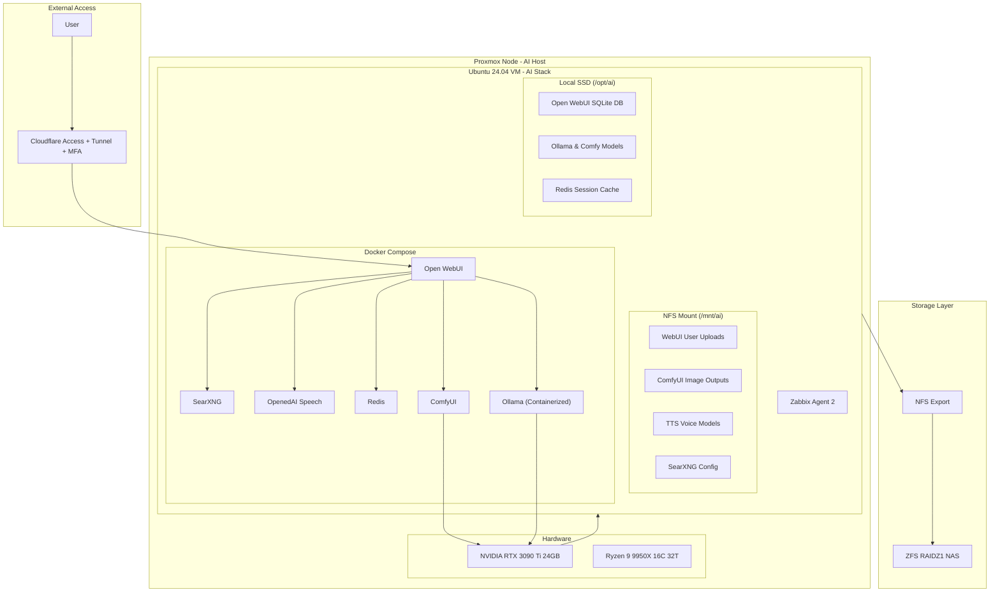

# System Architecture

This document details the hardware and software orchestration of the Private AI Stack, focusing on the hybrid integration between virtualized resources and containerized services.

---

## High-Level Diagram

A visual representation of the system architecture, showing the relationships between components such as Cloudflare, Proxmox, Docker Compose, and ZFS.

---

## ⚡ Hybrid Storage Strategy

To solve the I/O bottleneck inherent in running AI models over a 1Gbps network (NFS), this stack utilizes a tiered storage approach:

### 🚀 Performance Tier (Local SSD)

*   **Path**: `/opt/ai`
*   **Contents**: Ollama/ComfyUI model weights, the Open WebUI SQLite database, and Redis cache files.
*   **Benefit**: Eliminates "Database Locked" errors and GPU starvation caused by slow network model loading.

### 📦 Capacity Tier (NFS/NAS)

*   **Path**: `/mnt/ai`
*   **Contents**: User-uploaded documents for RAG, generated image outputs, and TTS voice assets.
*   **Benefit**: Leverages the **977GB** RAIDZ1 capacity for bulk data without impacting UI responsiveness.

---

## ⚡ Hypervisor-Level Tuning

To achieve near-metal performance for the NVIDIA RTX 3090 Ti GPU and Ryzen 9950X CPU, the following optimizations are applied at the Proxmox hypervisor level, including Hugepages and IOMMU isolation:

- **CPU Type (Host):** Setting the VM CPU type to `host` instead of `kvm64` allows direct access to instruction sets (AVX, AVX2, and AVX-512) crucial for high-performance tensor operations in LLMs and vision models.
- **Hugepages:** Enabling 2MB Hugepages on the Proxmox host reduces memory management overhead, significantly improving throughput for large, VRAM-intensive models like Gemma 27B.
- **IOMMU Isolation:**  The GPU and its associated audio controller are isolated within their own IOMMU group using `pcie_acs_override` to prevent interference with other PCIe devices.

---

## 📊 External Observability & Troubleshooting

Monitoring is decoupled from the primary cluster to provide out-of-band alerting and fault tolerance through a dedicated Zabbix integration.

### 1. Out-of-Band Monitoring (Zabbix)
A dedicated Zabbix server operates on independent hardware outside the Proxmox cluster.
* **Infrastructure**: SNMP/ICMP tracking of host thermals, fan speeds, and ZFS pool health.
* **VM/Agent**: Zabbix Agent 2 tracks memory pressure, NFS I/O latency, and Docker process states.
* **GPU**: `nvidia-smi` integration for VRAM utilization and thermal throttling alerts.
* **Container Metrics**: Tracks health and restart loops for the `ai-ollama` and `ai-openwebui` containers.

### 2. Alerting & Availability
* **Connectivity**: Monitors latency between the Cloudflare LXC and the external monitoring node.
* **Service Integrity**: External HTTP status checks on the Open WebUI endpoint to verify the full network chain.

### 3. Troubleshooting Hierarchy
The troubleshooting flow is now centralized within the Docker environment to quickly isolate failures across the stack:

1. **Application & LLM Engine**: 
   * `docker compose logs -f open-webui` — For frontend/API issues.
   * `docker compose logs -f ollama` — For model loading or inference errors.
2. **Container Runtime**:
   * `docker stats` — To identify resource contention or memory leaks.
   * `docker inspect ai-ollama` — To verify GPU passthrough and volume mounts.
3. **Hardware & Hypervisor**:
   * `dmesg` or `journalctl -xe` on the Proxmox host to identify PCIe/VFIO resets or GPU hardware crashes.

---
*Maintained by Nicolas Teixeira.*

