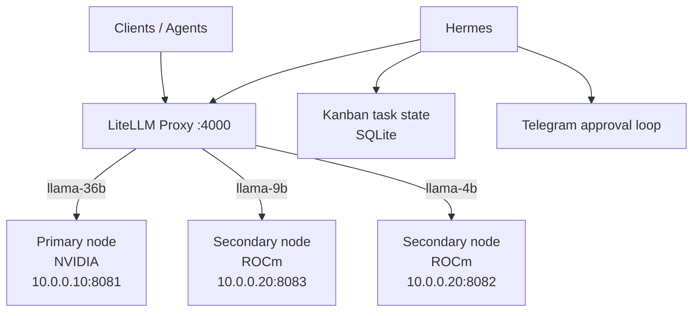

# Architecture

This document describes the **inference-first** architecture for the public AI Stack showcase.

## Topology overview

```mermaid
graph TD
    U[Clients / Agents] --> L[LiteLLM Proxy :4000]

    L -->|llama-36b| N1[Primary node\nNVIDIA\n10.0.0.10:8081]
    L -->|llama-9b| N2[Secondary node\nROCm\n10.0.0.20:8083]
    L -->|llama-4b| N3[Secondary node\nROCm\n10.0.0.20:8082]

    H[Hermes] --> L
    H --> K[Kanban task state\nSQLite]
    H --> T[Telegram approval loop]
```

## Inference data plane

- **Single API ingress** through LiteLLM (OpenAI-compatible).
- **Alias routing** maps client model names to backend services.
- **Dual-server deployment** separates larger and smaller model services across hardware profiles.

| Alias | Backend (example) | Notes |
| --- | --- | --- |
| `llama-36b` | `http://10.0.0.10:8081` | Larger-model path |
| `llama-9b` | `http://10.0.0.20:8083` | Mid-tier path |
| `llama-4b` | `http://10.0.0.20:8082` | Low-latency path |

## Control/orchestration plane (Hermes)

Hermes coordinates work above the inference layer:

1. Intake from events/webhooks.
2. Task registration and lifecycle tracking.
3. Human approval checkpoints via Telegram.
4. Execution and status propagation.

## Operational design intent

- Keep client integrations stable even when backend placement changes.
- Separate inference concerns (serving/routing) from orchestration concerns (tasking/approvals).
- Prefer explicit service boundaries over monolithic runtime behavior.

## Related docs

- [README](../README.md)
- [Configuration](./configuration.md)
- [Installation](./installation.md)
- [Models](./models.md)
- [Usage](./usage.md)
